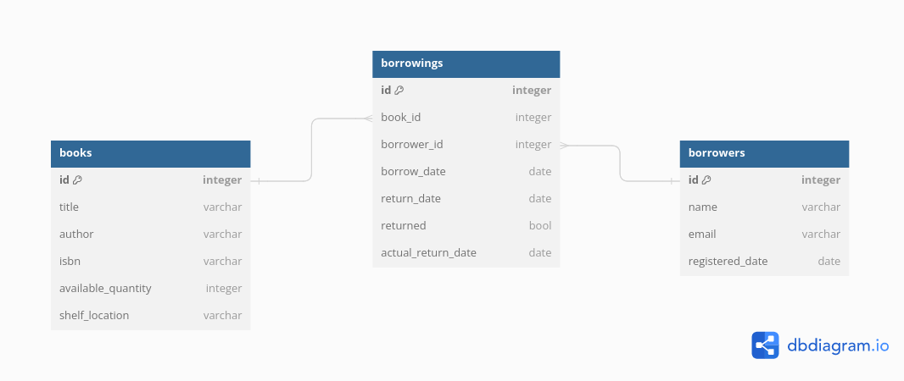

# Library Management System

This is a simple library management system implemented in Node.js with PostgreSQL database that allows you to manage books, borrowers, and the borrowing process and below you will find the available operations the system can make.


Books
1. Add a Book: Add a book with details such as title, author, ISBN, available quantity, and shelf location.
2. Update a Book: Update the details of a book including title, author, ISBN, available quantity, and shelf location.
3. Delete a Book: Delete a book from the system.
4. List all Books: View a list of all books in the library.
5. Search for a Book: Search for a book by title, author, or ISBN.

Borrowers
1. Register a Borrower: Register a borrower with simple details like name, email, and registered date.
2. Update Borrower's Details: Update the details of a borrower including name, email, and registered date.
3. Delete a Borrower: Remove a borrower from the system.
4. List all Borrowers: View a list of all registered borrowers.

Borrowing Process
1. Check out a Book: Borrowers can check out a book from the library. The system keeps track of which books are checked out and by whom.
2. Return a Book: Borrowers can return a book they have borrowed.
3. View Borrowed Books: Borrowers can view the books they currently have checked out.
4. Track Due Dates: The system keeps track of due dates for the books and lists books that are overdue.
    
This system helps in managing the library's inventory, keeping track of borrowers, and ensuring smooth borrowing and returning processes.


## Installation

1. Clone this repository.
2. Install docker-compose if you do not have it
3. sudo docker compose build
4. sudo docker compose up
5. Set up your PostgreSQL database.
    1. check bash script databaseCreationScript to create the databases
6. NOTE: the db.js file where we connect to the database please change the database credentials to your suitable credentials so it can connect to the database

## Usage
- **Description:** You need users to use the APIS and below you will find the allowed users credentials
- **Users:**
```json
{
    "username": "password",
    "username2": "password2",
    "username3": "password3",
    "username4": "password4",

}
```

## Database Schema

You will find it above under the name Database Schema Diagram, png file


## API Endpoints

## Books Endpoints


### Add a Book
- **Description:** Add a new book with details like title, author, ISBN, available quantity, and shelf location.
- **Method:** POST
- **Endpoint:** /addbook
- **Body:** 
```json
{
    "title": "title",
    "author": "author",
    "isbn": "132-0-1",
    "available_quantity":10,
    "shelf_location":"Upper shelf"
}
```

### Get All Books
- **Description:** Retrieve a list of all books.
- **Method:** GET
- **Endpoint:** /getbooks

### Get a Book
- **Description:** Retrieve details of a specific book by title, author, or ISBN.
- **Method:** GET
- **Endpoint:** /getbook
- **Body:** 
```json
{
    "search_fields":{
        "id":1,
        "title": "title",
        "author": "author",
        "isbn": "132-0-1",
        "available_quantity":10,
        "shelf_location":"Upper shelf"
    }
}
```

### Update a Book
- **Description:** Update details of a specific book.
- **Method:** POST
- **Endpoint:** /updatebook
- **Body:** 
```json
{
    "id":1,
    "search_fields":{
        "title": "title",
        "author": "author",
        "isbn": "132-0-1",
        "available_quantity":10,
        "shelf_location":"Upper shelf"
    }
}
```

### Delete a Book
- **Description:** Delete a book from the database.
- **Method:** POST
- **Endpoint:** /deletebook
- **Body:** 
```json
{
    "id":1,
}
```

## Borrowers Endpoints

### Add a Borrower
- **Description:** Register a new borrower with details like name, email, and registered date.
- **Method:** POST
- **Endpoint:** /addborrower
- **Body:** 
```json
{
    "name": "Ahmed",
    "email": "email",
    "registered_date": "2023-01-01"
}
```

### Get All Borrowers
- **Description:** Retrieve a list of all borrowers.
- **Method:** GET
- **Endpoint:** /getborrowers

### Get a Borrower
- **Description:** Retrieve details of a specific borrower.
- **Method:** GET
- **Endpoint:** /getborrower
- **Body:** 
```json
{
    "name": "Ahmed",
    "email": "email",
    "registered_date": "2023-01-01"
}
```

### Update a Borrower
- **Description:** Update details of a specific borrower.
- **Method:** POST
- **Endpoint:** /updateborrower
- **Body:** 
```json
{
    "id":1,
    "search_fields":{
        "name": "Ahmed",
        "email": "email",
        "registered_date": "2023-01-01"
    }
}
```

### Delete a Borrower
- **Description:** Delete a borrower from the database.
- **Method:** POST
- **Endpoint:** /deleteborrower
- **Body:** 
```json
{
    "id":1,
}
```

## Borrowings Endpoints

### Add a Borrowing
- **Description:** Record a book borrowing by a borrower.
- **Method:** POST
- **Endpoint:** /addborrowing
- **Body:** 
```json
{
    "book_id": 5,
    "borrower_id": 2,
    "borrow_date": "2024-02-01",
    "return_date":"2024-02-15"
}
```

### Get All Borrowings
- **Description:** Retrieve a list of all borrowing records.
- **Method:** GET
- **Endpoint:** /getallborrowings

### Get Borrower's Borrowings
- **Description:** Retrieve borrowing records of a specific borrower.
- **Method:** GET
- **Endpoint:** /getborrowerborrowings
- **Body:** 
```json
{   "search_fields":{
        "book_id": 5,
        "borrower_id": 2,
        "borrow_date": "2024-02-01",
        "return_date":"2024-02-15"
    }
}
```

### Get Late Borrowings
- **Description:** Retrieve borrowing records that are overdue.
- **Method:** GET
- **Endpoint:** /getlateborrowings

### Delete a Borrowing
- **Description:** Delete a borrowing record.
- **Method:** POST
- **Endpoint:** /deleteborrowing
- **Body:** 
```json
{
    "id":1,
}
```

### Return a Book
- **Description:** Mark a borrowing record as returned.
- **Method:** POST
- **Endpoint:** /closeborrowing
- **Body:** 
```json
{
    "return_date": "2024-02-15",
    "return_fields":{
        "id":1
    }
}
```

### Update a Borrowing
- **Description:** Update details of a borrowing record.
- **Method:** POST
- **Endpoint:** /updateborrowing
- **Body:** 
```json
{
    "id":1,
    "search_fields":{
        "book_id": 5,
        "borrower_id": 2,
        "borrow_date": "2024-02-01",
        "return_date":"2024-02-15"
    }
}
```

## Reports Endpoints

### Get Late Borrowings Report
- **Description:** Retrieve a report of late borrowing records.
- **Method:** GET
- **Endpoint:** /getreportslateborrowerings
```json
{
    "start_date": "2024-02-01",
    "end_date":"2024-02-15"
}
```

### Get All Borrowings Report
- **Description:** Retrieve a report of all borrowing records.
- **Method:** GET
- **Endpoint:** /getreportsallborrowerings
```json
{
    "start_date": "2024-02-01",
    "end_date":"2024-02-15"
}
```


